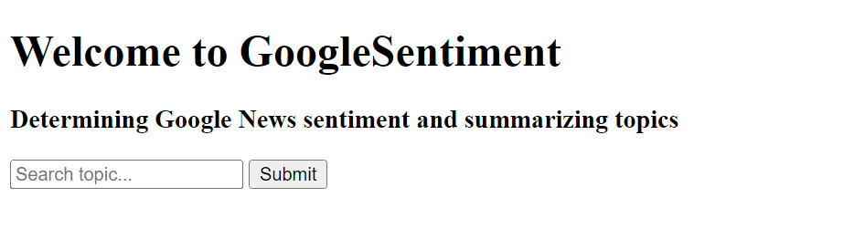
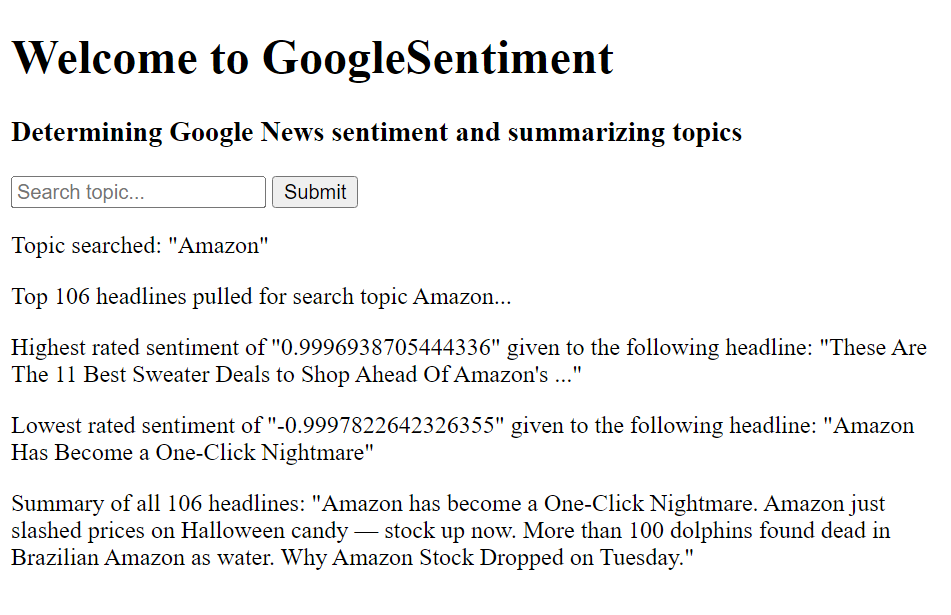

# GoogleNews Sentiment App 📨📬
### By Zachary Pulliam☕

This repo contains code for a Python Flask app that allows the user to input a search topic, and will then report the sentiment from Google News headlines and also attmept to summarize the headlines.

In its current state the app looks as follows upon running...

And as follows after running a search...

